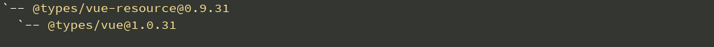

# vue-typescript-template-ui

一个非常简单的为[`Vue2.0`][1]和[`TypeScript2.0`][2]准备的项目开发环境，可以帮助你快速地开始一个项目的开发。

# 特性

- 引入了`Vue 2.0`全家桶的环境
- 配置好了`webpack`
- 配置好了一个`UI`库 - [element-ui][3]，让你开箱即用
- 使用了 `TypeScript2.0` 以后的新特性`@types`
- 由于`Vue2.0`采用`ES6`编写，类型声明中含有`Typescript`不支持的`ES6`特性，增加了 `TypeScript2.0` 对 [`Promise`][4] 等`es6`特性的支持
- 引入`lodash`，快速开启`FP`

有个这些特性，无需在开发环境的搭建上煞费苦心，你可以轻松地将本项目作为你的脚手架代码进行项目开发。

# 快速上手

安装依赖
```
npm install
```
开发测试：
```
npm run dev
```
部署到生产环境：
```
npm run build
```


# 自定义UI组件

倘若你不想引入`element-ui`，你也可以使用我的另外一个没有引入UI组件的纯净库：[vue-typescript-template][5]，这个库仅仅配置了`Vue 2.0`和`TypeScript`的基本开发环境。


# UI主题

关于主题的配置可以参考`element-ui`官方的 [`custom-theme`][6]

基本的配置过程如下：

- 安装element-theme：
```
$ npm i element-theme -D
```

- 安装element-theme-default
```
$ npm i element-theme-default -D 
```

- 生成变量文件

```
$ node_modules/.bin/et -i
```
![image_1b92frkkv1g7h7fo1pd41kp31k55m.png-13.9kB][7]

运行成功后，在你的项目根目录下会生成一个基于CSS4.0编写的`element-variables.css`，打开文件，可以编写你的主题配色：

![image_1b92fv4b81jr56i5o5l4o0h4r1g.png-75.2kB][8]


- 生成主题文件
在上一步编辑好 `element-variables.css` 后，执行此步骤:
```
$ node_modules/.bin/et
```

![image_1b92fs857n5d9k2car8did0g13.png-15.2kB][9]

这里你也可以加上`-w`参数进行实时编译。

- 在项目中引入

注意，只需要引入`index.css`
```
$ import './theme/index.css';
```

接下来，你就可以使用自己的主题了。


# 已经引入的库

name | version
--- | ---
typescript | 2.0.0+
Vue | 2.0.0+
Vue Router | 2.0.0+
vue-resource | 0.9.3
lodash | 4.0.0+
element-ui | 1.0.0+


# 注意点


## Typescript 2 以前

声明文件（`.d.ts`文件）是在`TypeScript`中使用现有`JavaScript`库的一个基本组成部分。

所有的`js`库在引入`ts`时，都必须顺带地加入类型声明文件（`d.ts`）,早期，有一个非常出色的库——[DefinitelyTyped][10]，它拥有一些主流的js库的类型声明文件。此外，为了更便捷地进行安装，还有一个非常强大的ts类型声明管理库——[typings][11]，它允许你通过这样的方式进行安装一个库的类型声明文件：

首先全局安装typings：

```
npm install typings -g
```

推荐采用这种方式进行一个类型定义库的安装：

```
typings install dt~vue --global --save
```

然后，项目根目录下会出现typings目录，结构如下：

![image_1b92hf66j18vo1ic71tcbcp1iac1t.png-8.5kB][12]

index.d.ts 的内容如下：参见ts的[三斜线指令][13]和[模块解析][14]

```
/// <reference path="globals/vue/index.d.ts" />
```

如此一来，我们可以在当前项目目录的任意位置采用如下方式导入Vue:

```
import * as Vue from 'vue';
```

但凡是会引入ts的库，如`vue全家桶`，或者`lodash`，都必须通过上述方式获取dts类型声明文件。

但是，`Typescript2`开始有了一些变化，请看下文。


## Typescript2以后

可以参见微软的这篇博文：[The Future of Declaration Files][15]

总的意思就是，**在TypeScript 2.0中获取类型声明除了npm之外不需要任何工具。**

比如，想要引入`lodash`，只需要执行:

```
npm install --save @types/lodash
```

然后你就可以直接使用了：

```
import * as _ from "lodash";
_.padStart("Hello TypeScript!", 20, " ");
```

此外，目前在使用`Typescript2 + Vue2`遇到的问题，及其解决办法整理如下：

issue | solution
--- | ---
`Typescript`编译表示不认识`vue`声明文件中的类型`Promise` | 安装es6-prommise `npm i @types/es6-promise -save`
`VueRouter is not a constructor` | 在`webpack`的 `resolve.alias` 中配置：`'vue-router$': 'vue-router/dist/vue-router.common.js'`


## 千万不要在本项目中使用Vue-resource

在之前进行项目升级的过程中，由于原项目采用的技术栈是`vue@1.0.21`、`TypeScript@1.8`、`vue-resource@0.9.3`和`vue-router@0.7.13`、`webpack@1.13.1`，我按照首先升级`typescript`, 接着升级`Webpack`，最后升级`Vue`, 结果遇到很多坑。关于这个问题根本原因，在于`vue-resource`使用的`type`声明文件仍然还在使用`vue 1`的`d.ts`:

运行：

```
npm install --save @types/lodash
```

你会看到：



这样一来，你会看到各种花式错误，例如`vue-router 2`找到了`vue 1`的`d.ts`, 这还能好好地玩耍吗？关于这个问题，我已经提交`PR`。

因此，在 `vue-resource` 官方仍未升级`d.ts`的时候，请不要使用它。

你可以用其他的库(和`vue`没有关系的库均可)来代替它，如`fetch`、`axios`。


  [1]: https://github.com/vuejs/vue
  [2]: https://github.com/Microsoft/TypeScript
  [3]: https://github.com/ElemeFE/element
  [4]: https://github.com/stefanpenner/es6-promise
  [5]: https://github.com/toxichl/vue-typescript-template
  [6]: http://element.eleme.io/#/en-US/component/custom-theme
  [7]: http://static.zybuluo.com/a472590061/jg8g8a6392ppmohabnoh7qii/image_1b92frkkv1g7h7fo1pd41kp31k55m.png
  [8]: http://static.zybuluo.com/a472590061/6oweqbrqjvfm221l3b64ny81/image_1b92fv4b81jr56i5o5l4o0h4r1g.png
  [9]: http://static.zybuluo.com/a472590061/64vc46bkcp3yaayxf6oimqtw/image_1b92fs857n5d9k2car8did0g13.png
  [10]: https://github.com/DefinitelyTyped/DefinitelyTyped
  [11]: https://github.com/typings/typings
  [12]: http://static.zybuluo.com/a472590061/crvbo8k38quhhywmn1j8pcz9/image_1b92hf66j18vo1ic71tcbcp1iac1t.png
  [13]: https://www.tslang.cn/docs/handbook/triple-slash-directives.html
  [14]: https://www.tslang.cn/docs/handbook/module-resolution.html
  [15]: https://blogs.msdn.microsoft.com/typescript/2016/06/15/the-future-of-declaration-files/